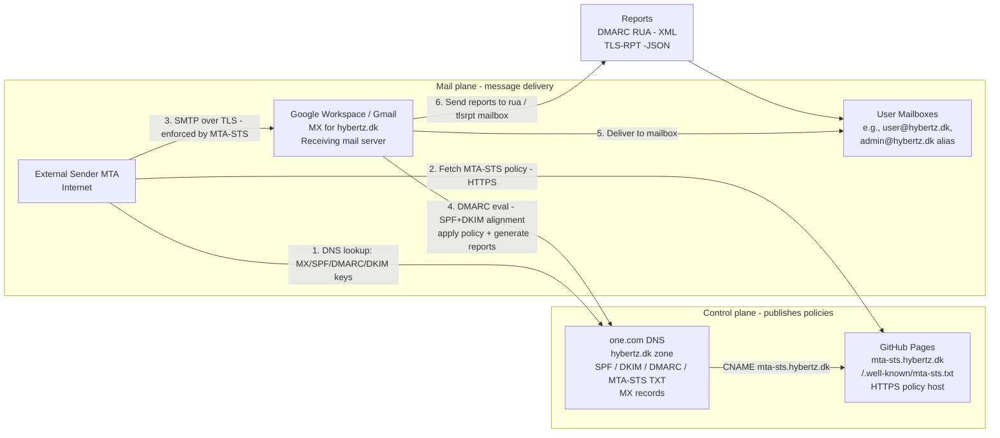
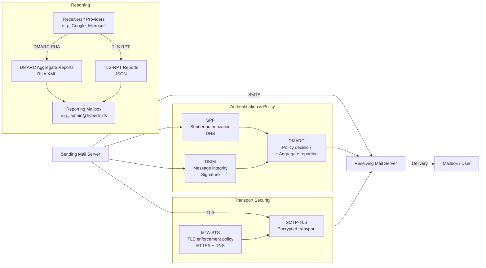

# Securing email delivery

This repository is all about how to set up an email account on a dedicated domain, to follow good and solid security practices to minimize the risks of being compromised.

There are a number of initiatives, that everyone on a personal level can do - what corporate big compannies do, I will completely leave that up to them :)

## Scope

The scope of this project, is to find and configure those features that already exists today, but rarely used. My goal is to harden email delivery as much as possible, but still

- Be able to send emails to anyone - no 3rd party end-to-end encryption, that requires the receiver to make any changes on their end.
- Make it as free as possible. Will need to pay for the domain registration and maybe Google Workspace

## Todos

1. Check if it's needed to have a Google Workspace account

## Setup

1. I have registered my domain at one.com
2. I have a GitHub repository, with this information and though GitHub Pages serving the **mta-sts** functionality
3. I have a Google Workspace and gmail for my email account.

## DKIM

DomainKeys Identified Mail (DKIM) ensures the integrity and authenticity of email messages by allowing the sending domain to cryptographically sign outgoing emails. The receiving mail server verifies the signature using a public key published in DNS, confirming that the message has not been altered in transit and that it originates from an authorized domain.

## SPF

Sender Policy Framework (SPF) allows a domain owner to specify which mail servers are authorized to send email on behalf of the domain. This information is published in DNS and checked by receiving mail servers during message delivery. SPF helps prevent sender address spoofing by enabling receivers to reject or flag messages sent from unauthorized sources.

## DMARC

Domain-based Message Authentication, Reporting and Conformance (DMARC) builds on SPF and DKIM to define how receiving mail servers should handle messages that fail authentication checks. DMARC enables domain owners to specify enforcement policies (monitor, quarantine, reject) and receive aggregated reports, improving protection against spoofing and phishing while providing visibility into email authentication behavior.

## MTA-STS

Mail Transfer Agent Strict Transport Security (MTA-STS) enforces encrypted transport for inbound email delivery by publishing a policy that requires SMTP connections to use TLS. The policy is retrieved over HTTPS and cached by sending mail servers, preventing downgrade attacks and ensuring that email is not delivered over unencrypted connections.

## SMTP-TLS

SMTP Transport Layer Security (SMTP-TLS) secures email transport between mail servers by encrypting SMTP connections using TLS. When supported by both parties, SMTP-TLS protects emails against interception and tampering during transit. Unlike MTA-STS, SMTP-TLS alone is opportunistic unless explicitly enforced by policy.

## Diagram

